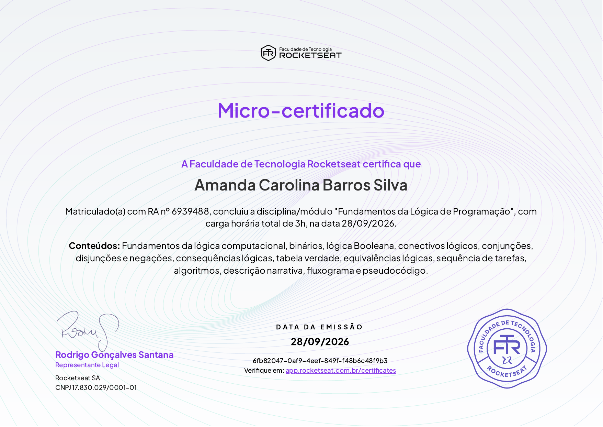

# Formação Lógica de Programação

Estudos e práticas da formação de **Lógica de Programação** da [Rocketseat](https://www.rocketseat.com.br), organizados por módulo.

Este repositório reúne os exercícios que resolvi durante a formação, com as soluções revisadas e os principais aprendizados de cada etapa.

---

## Progresso da formação

A formação tem 7 níveis. Cada nível concluído gera um micro-certificado, e o último nível libera o certificado final.

| Nível | Tema | Status |
|---|---|---|
| 1 | Fundamentos da Lógica de Programação | ✅ Concluído — quiz com 100% de acerto |
| 2 | Escrevendo o seu primeiro programa | ⏳ Em andamento |
| 3 | Lendo, depurando e entendendo códigos | 🔒 A fazer |
| 4 | Boas práticas e legibilidade de código | 🔒 A fazer |
| 5 | Desafios com raciocínio lógico | 🔒 A fazer |
| 6 | Estrutura de dados | 🔒 A fazer |
| 7 | Certificado final em Lógica de Programação | 🔒 A fazer |

---

## Conteúdo

### Nível 1 — Fundamentos da Lógica de Programação

| Desafio | O que tem | Link |
|---|---|---|
| Conectivos e Tabela-Verdade | Conjunção, disjunção, negação, condicional e bicondicional, com tabelas-verdade e exercícios do dia a dia | [Ver pasta](./conectivos-e-tabela-verdade) |
| Algoritmos | Descrição narrativa, fluxogramas e 10 exercícios de pseudocódigo | [Ver pasta](./representacao-de-algoritmos) |

---

## O que aprendi até aqui

- **Lógica booleana:** proposições simples e compostas, valores verdadeiro e falso
- **Conectivos lógicos:** E (`^`), OU (`v`), NÃO (`~`), SE... ENTÃO (`→`) e SE E SOMENTE SE (`↔`)
- **Tabela-verdade:** montar e resolver tabelas com 2, 3 e 5 proposições
- **Algoritmos:** sequência lógica de passos para resolver um problema
- **Descrição narrativa:** escrever algoritmos em linguagem natural
- **Fluxograma:** representar algoritmos com símbolos (início/fim, entrada/saída, processo e decisão)
- **Pseudocódigo:** entrada e saída de dados, variáveis, condicionais (`Se`) e repetição (`Enquanto`)
- **Teste de mesa:** conferir um algoritmo passo a passo, acompanhando o valor das variáveis

---

## Certificados

### Nível 1 — Fundamentos da Lógica de Programação

Micro-certificado emitido pela **Faculdade de Tecnologia Rocketseat** em 28/09/2026.

**Conteúdos:** fundamentos da lógica computacional, binários, lógica booleana, conectivos lógicos, conjunções, disjunções e negações, consequências lógicas, tabela-verdade, equivalências lógicas, sequência de tarefas, algoritmos, descrição narrativa, fluxograma e pseudocódigo.

Verificação: [app.rocketseat.com.br/certificates](https://app.rocketseat.com.br/certificates) — código `6fb82047-0af9-4eef-849f-f48b6c48f9b3`

---

## Contato

