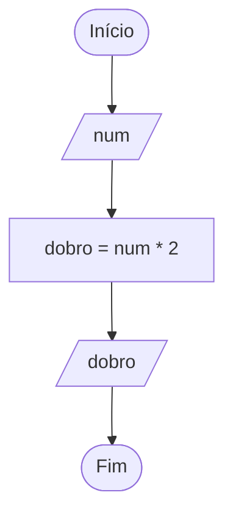
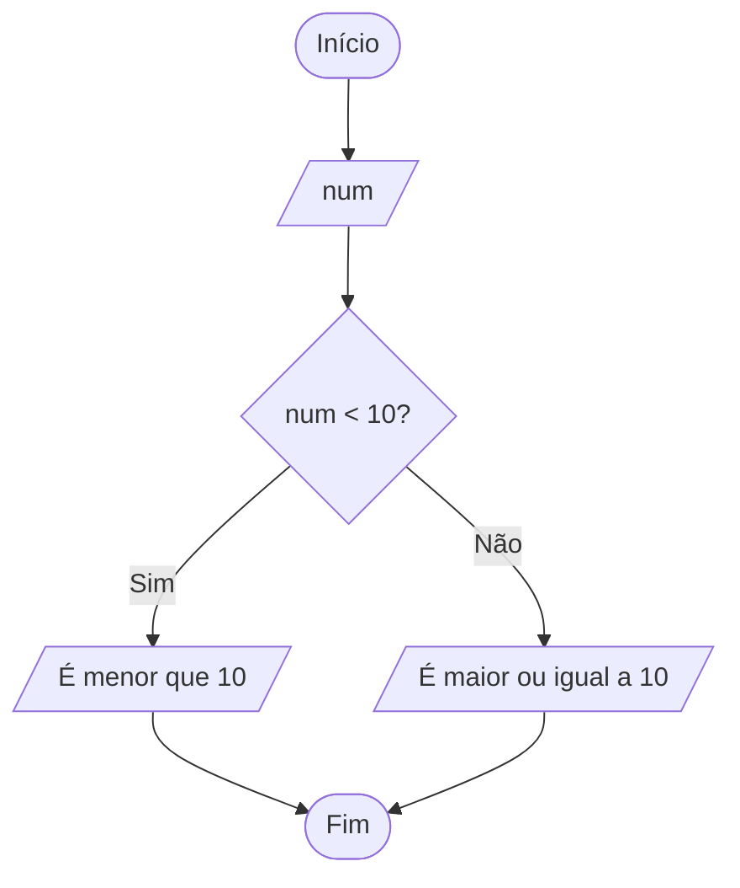
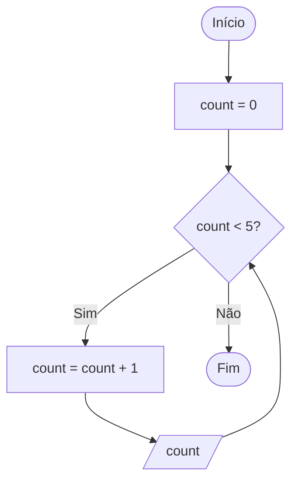

# Representação de Algoritmos

Desafios práticos da formação de **Lógica de Programação** da Rocketseat.

Um algoritmo pode ser representado de três formas. Aqui pratiquei cada uma delas:

1. [Descrição narrativa](#1-descrição-narrativa) — os passos escritos em linguagem natural
2. [Fluxograma](#2-fluxograma) — os passos desenhados com símbolos
3. [Pseudocódigo](#3-pseudocódigo) — os passos escritos de um jeito próximo ao código

---

# 1. Descrição narrativa

Algoritmos do dia a dia escritos em português, com os verbos no infinitivo e usando decisões ("se") quando existe mais de um caminho.

## Fazer um café coado

1. Pegar uma leiteira e colocar 500 ml de água
2. Ligar o fogo e colocar a leiteira para esquentar
3. Enquanto a água esquenta, pegar a garrafa de café e o suporte do filtro
4. Colocar o filtro de papel no suporte e adicionar 5 colheres de pó de café
5. Esperar a água ferver
6. Adicionar 3 colheres de açúcar na água
7. Esperar 1 minuto e desligar o fogo
8. Despejar a água quente no filtro
9. Esperar toda a água escorrer e retirar o suporte com o filtro
10. Fechar a garrafa e servir o café

## Configurar o despertador no celular

1. Pegar o celular
2. Desbloquear o celular
3. Abrir a lista de aplicativos e procurar por "Despertador" ou "Alarme"
4. Abrir o aplicativo e tocar em adicionar novo alarme
5. Definir o horário desejado
6. **Se** quiser que o alarme se repita, escolher os dias da semana
7. **Se** quiser outro toque, escolher o som do alarme
8. **Se** quiser identificar o alarme, digitar um nome para ele
9. Tocar em Salvar
10. Conferir se o alarme aparece ativado na lista

## Ligar um computador

1. **Se** for notebook:
   - **Se** a bateria estiver fraca, conectar o carregador na tomada
   - Abrir a tampa do notebook
   - Apertar o botão Ligar
2. **Senão** (computador de mesa):
   - Conectar os cabos do monitor, teclado e mouse no CPU
   - Conectar os cabos de energia do CPU e do monitor na tomada
   - Apertar o botão Ligar do monitor
   - Apertar o botão Ligar do CPU
3. Esperar o sistema carregar
4. Digitar a senha, se houver

## Carregar o celular

1. Pegar o cabo e a fonte do carregador
2. Conectar o cabo na fonte
3. Conectar a fonte na tomada
4. Conectar o cabo no celular
5. Verificar se o ícone de carregamento aparece na tela
6. **Se** não aparecer, conferir se os encaixes estão firmes e se a tomada funciona
7. Aguardar até a bateria chegar a 100%
8. Desconectar o cabo do celular

## Assistir a um filme em casa

1. Ligar o dispositivo (TV, tablet, celular ou computador)
2. Conectar o dispositivo à internet
3. Escolher a plataforma de streaming
4. **Se** o aplicativo não estiver instalado, instalar
5. Abrir o aplicativo
6. **Se** não tiver conta, fazer o cadastro e a assinatura
7. Entrar com usuário e senha
8. Buscar o nome do filme
9. **Se** o filme não estiver disponível, escolher outro filme ou outra plataforma
10. Clicar em "Assistir"

---

# 2. Fluxograma

## Símbolos

| Símbolo | Nome | Uso |
|---|---|---|
| Oval | Terminal | Início e fim |
| Paralelogramo | Entrada / Saída | Ler ou mostrar um valor |
| Retângulo | Processo | Contas e atribuições |
| Losango | Decisão | Pergunta com sim ou não |
| Seta | Fluxo | Ordem dos passos |

## Exercício 1 — Calcular o dobro de um número



## Exercício 2 — Verificar se o número é menor que 10



## Exercício 3 — Contar até 5



**Teste de mesa:**

| count antes | count < 5? | count depois | Mostra |
|---|---|---|---|
| 0 | Sim | 1 | 1 |
| 1 | Sim | 2 | 2 |
| 2 | Sim | 3 | 3 |
| 3 | Sim | 4 | 4 |
| 4 | Sim | 5 | 5 |
| 5 | Não | — | Fim |

---

# 3. Pseudocódigo

## Legenda

| Comando | O que faz |
|---|---|
| `Escreva(...)` | Mostra algo na tela (saída) |
| `Leia x` | Recebe um valor digitado e guarda em `x` (entrada) |
| `x ← valor` | Atribuição: `x` recebe o valor |
| `Se ... então` / `Senão` / `FimSe` | Estrutura condicional |
| `Enquanto ... faça` / `FimEnquanto` | Estrutura de repetição |
| `%` | Resto da divisão |

## 1. Imprimir um número em tela

```
Início
  Escreva("Digite um número: ")
  Leia num
  Escreva("Você digitou: ", num)
Fim
```

## 2. Somar dois números

```
Início
  Escreva("Digite um número: ")
  Leia num1
  Escreva("Digite outro número: ")
  Leia num2
  soma ← num1 + num2
  Escreva("Resultado: ", soma)
Fim
```

## 3. Contar de 1 até 10 usando loop

```
Início
  i ← 1
  Enquanto i ≤ 10 faça
    Escreva(i)
    i ← i + 1
  FimEnquanto
Fim
```

## 4. Verificar se o número é par ou ímpar

Um número é par quando o resto da divisão por 2 é zero.

```
Início
  Escreva("Digite um número: ")
  Leia num
  Se num % 2 = 0 então
    Escreva("Par")
  Senão
    Escreva("Ímpar")
  FimSe
Fim
```

## 5. Verificar se o número é positivo, negativo ou zero

Se o número não é maior nem menor que zero, só pode ser zero.

```
Início
  Escreva("Digite um número: ")
  Leia num
  Se num > 0 então
    Escreva("Positivo")
  Senão
    Se num < 0 então
      Escreva("Negativo")
    Senão
      Escreva("Zero")
    FimSe
  FimSe
Fim
```

## 6. Calcular a média de 3 notas

Os parênteses garantem que a soma acontece antes da divisão.

```
Início
  Escreva("Digite a primeira nota: ")
  Leia nota1
  Escreva("Digite a segunda nota: ")
  Leia nota2
  Escreva("Digite a terceira nota: ")
  Leia nota3
  media ← (nota1 + nota2 + nota3) / 3
  Escreva("A média das suas notas foi: ", media)
Fim
```

## 7. Verificar se o aluno foi aprovado (média ≥ 5)

```
Início
  Escreva("Digite a primeira nota: ")
  Leia nota1
  Escreva("Digite a segunda nota: ")
  Leia nota2
  Escreva("Digite a terceira nota: ")
  Leia nota3
  media ← (nota1 + nota2 + nota3) / 3
  Se media ≥ 5 então
    Escreva("Aprovado")
  Senão
    Escreva("Reprovado")
  FimSe
Fim
```

## 8. Maior entre dois números

Inclui o caso de borda em que os dois números são iguais.

```
Início
  Escreva("Digite um número: ")
  Leia num1
  Escreva("Digite outro número: ")
  Leia num2
  Se num1 > num2 então
    Escreva("Maior: ", num1)
  Senão
    Se num2 > num1 então
      Escreva("Maior: ", num2)
    Senão
      Escreva("Iguais")
    FimSe
  FimSe
Fim
```

## 9. Mostrar os múltiplos de 3 até 30

O laço passa por todos os números de 1 a 30, e o `Se` funciona como filtro: só mostra quem tem resto 0 na divisão por 3.

```
Início
  i ← 1
  Enquanto i ≤ 30 faça
    Se i % 3 = 0 então
      Escreva(i)
    FimSe
    i ← i + 1
  FimEnquanto
Fim
```

Solução alternativa: começar em 3 e somar 3 a cada volta, sem precisar do `Se`.

```
Início
  i ← 3
  Enquanto i ≤ 30 faça
    Escreva(i)
    i ← i + 3
  FimEnquanto
Fim
```

## 10. Contagem regressiva de 10 até 1

```
Início
  i ← 10
  Enquanto i ≥ 1 faça
    Escreva(i)
    i ← i - 1
  FimEnquanto
Fim
```

---

# Aprendizados

- Em descrição narrativa, cada passo é uma ação, com verbos no mesmo tempo verbal
- Num fluxograma, toda seta sai de um símbolo e chega em outro, sem pontas soltas
- Todo bloco que abre precisa fechar: `Se` → `FimSe`, `Enquanto` → `FimEnquanto`
- O nome da variável precisa ser exatamente igual em todo o código, inclusive maiúsculas e minúsculas
- `←` guarda um valor; `=` compara
- O `%` (resto da divisão) resolve par/ímpar e múltiplos
- Teste de mesa: seguir o algoritmo passo a passo, anotando o valor das variáveis
- Pensar nos casos de borda: número igual a 10, dois números iguais, zero
